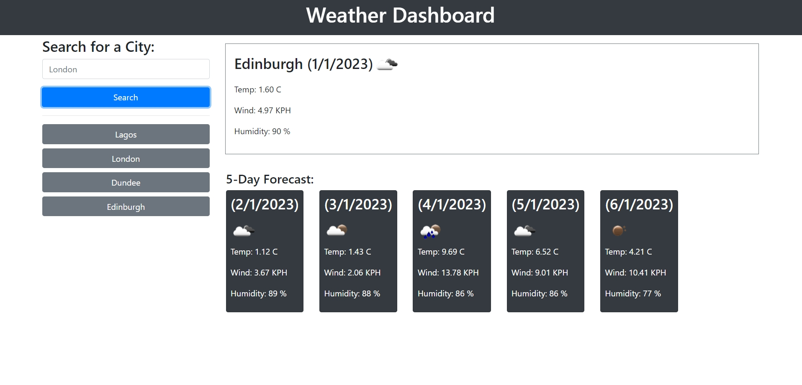

# Weather-Dashboard

## Description

Weather-Dashboard is an application to find a weather condition of a given city both the current and 5-Days forecast at the same time. The server-side API used to get response data object is retrieved from the Open Weather APi. The current weather section is including the following weather characters and date.

<ul>
    <li>City, Date, Icon-image</li>
    <li>Temperature</li>
    <li>Humidity</li>
    <li>Wind Speed</li>
</ul>

The 5-days weather forecast also displays below the current weather conditions section and it includes the following information for each day:

<ul>
    <li>Date</li>
    <li>Temperature</li>
    <li>Humidity</li>
    <li>Wind Speed</li>
</ul>

The local storage is used here to store the previous search city and display them to the user in the left side of the page under the list group. The user can also clear the search history by clicking the clear history button. If the user wants to see the past search city weather condition again, just click the list group item cities under the clear history button.

## Installation

Here are some guidelines for installing the project on your local machine:

<ol>
    <li>Clone or download the repository to your own local machine.</li>
    <li>Open the HTML file in your browser.</li>
    <li>Enjoy and don't hesitate to contribute! </li>
</ol>

Project link:https://hollusam.github.io/Work-Day-Scheduler/

## Tech/framework used

Project is created using:
<ul>
    <li>HTML5</li>
    <li>CSS3</li>
    <li>JavaScript</li>
    <li>Third party API (jQuery, jQuery moment, Bootstrap)</li>
</ul>

## Usage

When a user searches for a city they are presented with current and future conditions for that city and that city is added to the search history. It works well for travellers who want to see the weather outlook for multiple cities so that they can plan their trip accordingly.
## Screenshot

## Contact

Samuel: https://instagram.com/hollusam

## Acknowledgement

<a href="https://developer.mozilla.org/en-US/docs/Web/JavaScript/Reference/Global_Objects/Array/map">Mdn web docs</a>

<a href="https://www.w3schools.com/">W3schools</a>

<a href="https://github.com">Github page</a>

<a href="https://getbootstrap.com/">Boostrap</a>

<a href="https://releases.jquery.com/">jQuery</a>

<a href="https://jqueryui.com/">jQueryUI</a>

<a href="https://momentjs.com/">Moment.js</a>

<a href="https://openweathermap.org/">Open weather API</a>

## Credits

<li>Philip Howley (My Instructor)</li>

<li>Nic Catania (My personal TA)

<li>All the TAs of Triology Bootcamp

## License

N/A